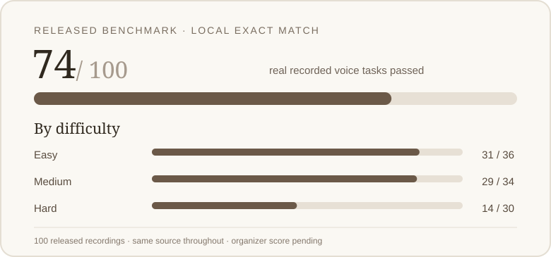
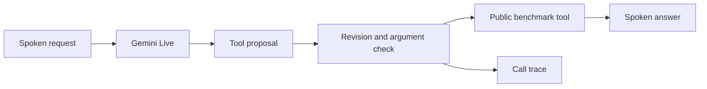

# Reprise

Reprise is a LiveKit voice agent built for Samsung Theme 05. It listens to spoken requests, handles changes of mind, calls the benchmark's tools, and answers aloud. Gemini Live handles the conversation; a small controller checks tool arguments and keeps an interrupted request from causing duplicate actions.

## Google Workspace voice planner

The new extension turns a corrected spoken request into Calendar events, tasks, Gmail drafts or sends, and a shopping checklist through **real Google APIs**. OAuth placeholders are in `.env.example`. Start the dashboard, connect Google, speak your request, review the plan, and confirm it. See the [setup and spoken test script](docs/PRODUCTIVITY.md).

The 77/100 result below belongs to the frozen benchmark version in [commit `0672c5d`](https://github.com/sahaj24/samsung-prism-test/commit/0672c5d) and the archived ZIP. The Google extension has no claimed benchmark score.

## The measured result



**77/100 recordings passed** in `released-v9`. We played all 100 released human recordings through Gemini Live and LiveKit, then checked the saved calls with the [original Full-Duplex-Bench v3 exact-match scorer](https://github.com/DanielLin94144/Full-Duplex-Bench/tree/main/v3). Every recording stays in the denominator, including service failures.

| Check | Result |
| --- | ---: |
| Strict tool-task passes | **77 / 100** |
| Completed recordings | 100 / 100 |
| Cases ending in an infrastructure failure | 2 |
| Retries after infrastructure errors | 5 |
| Easy tasks | 30 / 36 |
| Medium tasks | 27 / 34 |
| Hard tasks | 20 / 30 |

The agent used `gemini-3.8-live`, two concurrent rooms, the `instant` mock-tool latency profile, and one unchanged source version. The upstream code is pinned to `3e799c45a045256f47d5f1c9cda90157e2d2ec9e`. The [full report](evidence/released-v9/report.json), [original scorer output](evidence/released-v9/upstream_exact_report.json), and [case-by-case results](docs/benchmark-cases.md) are available to inspect.

**This is a local exact-match result. The organizer's official score is unknown.** The check measures tool selection and literal arguments; the upstream matcher skips dynamic result references. It does not measure spoken response quality or the contest's normalized benchmark component. Fresh cloud-model runs can differ. The 85/100 target has not been reached; no leaderboard rank is claimed.

See the [run comparison](docs/benchmark-history.md) for the earlier full runs. Timing figures from older runs are not presented as measurements of this version.

## Verify the saved score without API keys

The repository includes `dist/Reprise_Submission.zip`. It contains the run manifest, all 100 per-case results, tool events and client logs, and the score reports. The raw benchmark recordings are downloaded separately under the benchmark's license.

From a fresh checkout, run:

```sh
./reproduce.sh setup
reprise_verify_dir=$(mktemp -d)
unzip -q dist/Reprise_Submission.zip -d "$reprise_verify_dir"
uv run --frozen python third_party/fdb/v3/evaluate_pass_rate.py \
  --benchmark third_party/fdb/v3/benchmark_data_v2.json \
  --results-dir "$reprise_verify_dir/Reprise/evidence/released-v9" \
  --provider reprise \
  --output "$reprise_verify_dir/rechecked.json"
```

The original scorer should print **100 scenarios, 77 passed, 77.0%**. This rechecks saved tool calls without contacting Gemini or LiveKit.

To also check the source digest, case coverage, recorded calls, and retry history:

```sh
python3 build/audit_benchmark.py "$reprise_verify_dir/Reprise/evidence/released-v9" \
  --source "$reprise_verify_dir/Reprise/src/reprise"
```

The audit should report `77` passes and `100` total. The archived code matches the measured source digest; use the archive’s source for this audit because the working code now includes the Google extension. A fresh hosted run is a new measurement, so it need not return an identical score.

## Run the voice benchmark again

You need Python 3.12 (installed by [uv](https://docs.astral.sh/uv/getting-started/installation/)), Git, FFmpeg, internet access, a Gemini API key with Live access, and a LiveKit Cloud project. The public audio download is about 700 MB. Keep only one default benchmark worker connected to that LiveKit project while testing.

```sh
cp .env.example .env.local
# Fill GOOGLE_API_KEY, LIVEKIT_URL, LIVEKIT_API_KEY, and LIVEKIT_API_SECRET.
chmod 600 .env.local
./reproduce.sh setup --data
./reproduce.sh doctor
./reproduce.sh all --seed 20260927 --concurrency 2 --name fresh-01
```

The example configuration matches the measured run: guarded controller, **1000 ms** read settling, **900 ms** write settling, and `instant` mock-tool delays.

Check that `doctor` shows 100 audio files, 12 tool schemas, FFmpeg available, and accepted Gemini and LiveKit connections. Then `all` runs the behavior tests, starts its own worker, plays every released recording through the upstream streaming client, saves each tool trace, and stops the worker. Use a new `--name` for each run; an existing run is never overwritten.

For an exact input match, `shasum -a 256 data/fdb_v3.zip` should print `37545bd896f81718136598cf5be25d42ea9aa22efcd91f58370938d05d7d672f`. If the archive differs, treat the new run as a different dataset version.

Read `runs/fresh-01/report.json` for the new run's exact-match score. To recheck it with the original scorer:

```sh
uv run --frozen python third_party/fdb/v3/evaluate_pass_rate.py \
  --benchmark third_party/fdb/v3/benchmark_data_v2.json \
  --results-dir runs/fresh-01 \
  --provider reprise \
  --output runs/fresh-01/upstream_exact_report.json
```

For a short connection check, add `--limit 2` to the `all` command and choose a different run name. That small check does not estimate the full score. You can also run `./reproduce.sh agent` and `./reproduce.sh evaluate --name fresh-01 --concurrency 2` in separate terminals.

## How it handles a correction



Each proposal carries the current input revision. If the user corrects a request before a tool is dispatched, the older proposal is dropped. The controller also checks arguments, uses results from earlier calls when a later call depends on them, and merges identical pending actions. Once a write has been dispatched, it stays in the action ledger. The twelve benchmark API contracts are public; the agent contains no scenario answers. `REPRISE_POLICY=baseline` disables those controller safeguards for an ablation.

## Washer-support demonstration

The repository also has a small Samsung washer-code lookup. With credentials set, start the agent, then the dashboard in another terminal:

```sh
./reproduce.sh agent
# In a second terminal:
npm ci --prefix demo
./reproduce.sh demo
```

Open `http://127.0.0.1:8844`, allow microphone access, and start a conversation. The dashboard shows speech, tool actions, and the source used for an answer. The lookup covers general 4C/4E and 5C/5E guidance from [Samsung UK](https://www.samsung.com/uk/support/home-appliances/what-do-the-codes-on-my-washing-machine-mean/); it cannot diagnose a specific appliance or control it. The bundled extension replay uses a **synthetic test voice**, labeled as such in the video.

The recorded video and deck are the earlier `released-v8` demonstration (74/100); the current score and code are documented above. In this GitHub checkout, the final assets are in `dist/`: `Reprise_Submission.zip`, `Reprise_recorded_demo.mp4` (3:04), and `Reprise_Theme05_Submission.pptx` (eight slides). Inside the ZIP, the video and deck are at its top level. Credentials stay in ignored `.env.local` and are excluded from the bundle.

## Project files

| Path | Purpose |
| --- | --- |
| `src/reprise/agent.py` | LiveKit and Gemini voice session |
| `src/reprise/coordinator.py` | Corrections, validation, and action ledger |
| `src/reprise/evaluation.py` | Released-audio runner and local exact scoring |
| `demo/` | Local dashboard |
| `tests/` | Controller and provider-contract checks |
| `docs/RESEARCH.md` | Research basis and evaluation limits |

Full-Duplex-Bench belongs to its authors and is used under its upstream CC BY-NC 4.0 license. Samsung support material belongs to Samsung. Reprise is a participant prototype, not an official Samsung product.
