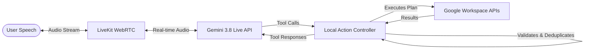

# Reprise

An interruptible, real-time voice agent built with Gemini Live and LiveKit.

Reprise listens to spoken requests, handles interruptions and changes of mind, gracefully executes multi-step tool calls, and answers aloud. The architecture relies on Gemini Live for fast conversational intelligence and a custom local controller to check tool arguments and prevent duplicate actions.

## Architecture



## Extension Use Case: Google Workspace Planner

This repository extends the core benchmark with a Google Workspace Voice Planner. It turns spoken requests (including mid-sentence corrections) into Calendar events, Tasks, Gmail drafts, and shopping checklists using live Google APIs.

Features:
- Real API Integrations: Uses genuine Google OAuth 2.0 and REST endpoints.
- Graceful Corrections: Updates the plan and asks for confirmation before executing if the user changes their mind.
- Local Dashboard: Includes a companion dashboard to authenticate with Google and view real-time planning output.

## Setup and Installation

Requirements:
- Python 3.12 (managed via `uv`)
- Node.js (for the demo dashboard)
- FFmpeg
- API Keys: Gemini API, LiveKit Cloud, Google Workspace OAuth Client

Configuration:
1. Clone the repository.
2. Copy the example environment file:
   ```sh
   cp .env.example .env.local
   chmod 600 .env.local
   ```
3. Fill in your credentials in `.env.local` (Gemini, LiveKit, Google OAuth).
4. Run the setup script to install dependencies and download the benchmark data:
   ```sh
   ./reproduce.sh setup --data
   ./reproduce.sh doctor
   ```

## Running the Google Workspace Extension

To test the extension end-to-end, start the agent backend and the web dashboard in two separate terminals.

Terminal 1 (Backend Agent):
```sh
./reproduce.sh agent
```

Terminal 2 (Web Dashboard):
```sh
npm ci --prefix demo
./reproduce.sh demo
```

Open `http://127.0.0.1:8844`, connect your Google account, and start speaking.

## Evaluation and Benchmark Results

This agent is evaluated against Full-Duplex-Bench v3. The frozen benchmark version in this repository achieved 77/100.

| Check | Result |
| --- | ---: |
| Strict tool-task passes | 77 / 100 |
| Completed recordings | 100 / 100 |
| Easy tasks | 30 / 36 |
| Medium tasks | 27 / 34 |
| Hard tasks | 20 / 30 |

Note: This is a local exact-match result using the benchmark's literal argument matcher.

The full report, configuration, and case-by-case results for this run are available in the repository:
- [Full Report](evidence/released-v9/report.json)
- [Original Scorer Output](evidence/released-v9/upstream_exact_report.json)
- [Case-by-case Results](docs/benchmark-cases.md)

### Reproduction Script

To re-run the benchmark and verify the score, use the following reproduction script. This will play all 100 released human recordings through Gemini Live and save the call traces.

```sh
./reproduce.sh all --seed 20260927 --concurrency 2 --name my-eval-run
```

Results and logs will be saved in the `runs/my-eval-run` directory.

## Project Structure

- `src/reprise/agent.py`: LiveKit and Gemini voice session integration.
- `src/reprise/coordinator.py`: Core logic for handling corrections, validation, and action ledgers.
- `src/reprise/google_workspace.py`: Live Google OAuth and REST adapters.
- `demo/`: Local companion dashboard for the extension.
- `tests/`: Controller and provider-contract checks.
