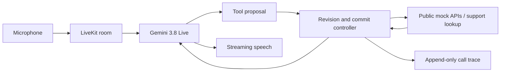

# Reprise

An interruptible LiveKit voice agent for Samsung Theme 05, using `gemini-3.8-live`.

Reprise listens for corrections while tools run, validates tool arguments, and prevents duplicate actions within an active request. Research rationale and limitations are in [docs/RESEARCH.md](docs/RESEARCH.md).


## Setup

Requirements: Python 3.12 (managed by uv), [uv](https://docs.astral.sh/uv/getting-started/installation/), Git, FFmpeg, internet access, a Gemini API key with Live access, and a LiveKit project. Agent inference is hosted; no local GPU is required for the agent. The official ASR evaluation has separate GPU requirements.

```sh
cp .env.example .env.local
# Fill GOOGLE_API_KEY, LIVEKIT_URL, LIVEKIT_API_KEY and LIVEKIT_API_SECRET.
chmod 600 .env.local
./reproduce.sh setup --data
./reproduce.sh doctor
./reproduce.sh test
```

Credentials stay in `.env.local`, which is ignored and excluded from the submission package. Never commit it. The setup command checks out the pinned benchmark revision and downloads the released audio. Keep its license and attribution.

## Start the agent

For a clean end-to-end run after filling `.env.local`, use one command:

```sh
./reproduce.sh all --concurrency 2 --name released-01
```

It installs the locked environment, verifies the pinned benchmark and credentials, runs the behavior checks, starts a LiveKit worker, streams the selected recordings, writes the report, and stops the worker. If an `OPENAI_API_KEY` is present, it also runs the upstream semantic pass-rate judge. Without that key, the report is clearly marked provisional exact matching. For a short integration check, add `--limit 2`. Run this with no other default LiveKit worker connected to the same project.

```sh
./reproduce.sh agent
```

In another terminal:

```sh
# Deterministic development sample; provisional exact matching.
./reproduce.sh evaluate --limit 12 --concurrency 2 --name development-01

# All released recordings; use one session at a time for a stricter free quota.
./reproduce.sh evaluate --concurrency 1 --name released-01
```

Each evaluation creates `runs/<name>/manifest.json`, per-recording audio and call traces, and an updating `report.json`. The manifest records the source digest, selected inputs, seed, model, upstream commit and infrastructure retry limit. Run names cannot be reused. Temporary connection or model-session failures are retried twice; every attempt and its error are retained in the per-recording evidence. A persistent LiveKit DNS outage pauses the run and then aborts it, rather than marking a series of recordings as agent failures. Do not change agent code during a measured run.

**These commands produce provisional tool-completion results, not the organizer's official score.** They use the original streaming client and original exact-match strict scorer. They do not run the pinned semantic judge, independent ASR, response-quality evaluation, or organizer normalization.

The best completed local run is `runs/released-v8`: 74/100 on all 100 released recordings, independently confirmed by the upstream exact-match pass-rate scorer. It had zero infrastructure failures and an unchanged source digest. The organizer's official score remains unreported.

The upstream tool evaluator, rerun on the same saved recordings without the LLM judge, reports 91.8% average tool-selection accuracy and 81.7% average argument accuracy among 99 samples with agent speech. A separate `timing_proxy_report.json` measures 3.69 seconds from agent VAD speech end to first audible output (99 recordings) and 2.37 seconds to first tool call (95 recordings). These timing proxies use the saved audio and agent events, not the upstream independent ASR or task-completion judge, so they are not official latency results. The local run used the `instant` mock latency profile; published model timings use the paper's protocol and should not be compared as a ranking.

## Architecture



Every proposal gets the current input revision. The controller rejects obsolete preparation, validates arguments and checks dependent identifiers against previous results or an explicitly spoken ID. Identical pending actions share one operation. Executed writes remain in the ledger when speech is interrupted. All dispatched benchmark calls enter `/tmp/agent_tool_calls.log` for compatibility with the original harness.

`REPRISE_POLICY=baseline` removes the revision barrier, result provenance checks and duplicate suppression, providing an ablation with the same audio model, prompt and tool contracts. `guarded` enables the controller. The default settle intervals are 1000 ms for reads and 900 ms for writes, in addition to the model's endpointing.

## Washer-help extension

Keep the agent running in the first terminal. In a second terminal:

```sh
npm ci --prefix demo
./reproduce.sh demo
```

Open `http://127.0.0.1:8844` on the same computer, click **Start conversation**, and allow microphone access. The browser gets a short-lived LiveKit room token from a server bound to loopback; the API secret stays in `.env.local`. A room created by the demo selects the `lookup_manual` tool instead of benchmark tools. The dashboard shows the live conversation, action timeline, source lookup, and the clearly labeled 74/100 local benchmark result. The support lookup covers general Samsung washer codes 4C/4E and 5C/5E. It states when it cannot find a code. The prototype does not verify model-specific steps or control an appliance.

The source is [Samsung UK's washing machine code guide](https://www.samsung.com/uk/support/home-appliances/what-do-the-codes-on-my-washing-machine-mean/). An actual audio replay with synthetic spoken input is stored in `runs/extension-question.wav`, `runs/extension-response.wav`, and the matching `runs/reprise-demo-*/events.jsonl` trace; these development files are not in the clean submission package unless explicitly copied into its evidence folder.

## Repository map

| Location | Purpose |
| --- | --- |
| `src/reprise/agent.py` | LiveKit / Gemini integration |
| `src/reprise/coordinator.py` | Revisions, validation, operation ledger and commit barrier |
| `src/reprise/catalog.py` | Public tool schemas; no benchmark answers |
| `src/reprise/backend.py` | Unchanged upstream mock functions with asynchronous delays |
| `src/reprise/evaluation.py` | Offline screening; never imported by the running agent |
| `tests/` | Cancellation, duplicate actions, provenance and provider contract checks |
| `docs/RESEARCH.md` | Source-backed rationale and evaluation limits |
| `third_party/fdb/` | Pinned upstream checkout, downloaded by setup |

## License and attribution

Full-Duplex-Bench belongs to its original authors and uses its upstream license (CC BY-NC 4.0 at the pinned revision). This project preserves attribution and does not relicense upstream code or recordings. Samsung support material remains Samsung's; any included support summaries link to the original source. Reprise is a participant prototype, not an official Samsung product.
