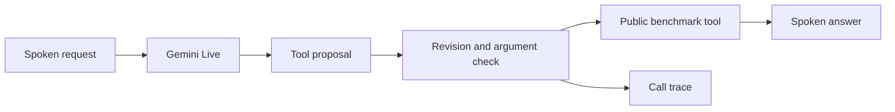

# Reprise

Reprise is a LiveKit voice agent built for Samsung Theme 05. It listens to spoken requests, handles changes of mind, calls the benchmark's tools, and answers aloud. Gemini Live handles the conversation; a small controller checks tool arguments and keeps an interrupted request from causing duplicate actions.

## The measured result


We played **all 100 released human recordings** through the agent and scored the saved tool calls with the [original Full-Duplex-Bench v3 exact-match scorer](https://github.com/DanielLin94144/Full-Duplex-Bench/tree/main/v3). The run used one source version throughout, the pinned upstream commit `3e799c45a045256f47d5f1c9cda90157e2d2ec9e`, `gemini-3.8-live`, two concurrent rooms, and the `instant` mock-tool latency profile.

| Check | What we observed |
| --- | ---: |
| Strict tool-task passes | **74 / 100** |
| Completed recordings | 100 / 100 |
| Infrastructure errors or retries | 0 |
| Cases with an audible agent response | 99 / 100 |
| Average tool-selection accuracy | 91.8% |
| Average argument accuracy | 81.7% |

The last two percentages come from the upstream tool evaluator on the 99 cases with agent speech. Of the 26 strict failures, 15 involved the wrong set of tools and 11 involved wrong arguments. Difficult cases and requests needing two or three tools are the main remaining weakness: hard tasks passed **14/30**, while one-tool tasks passed **56/66**.

**What the 74 means:** It is a repeatable score for these *saved outputs* under strict, literal argument matching. The organizer's official score is still unknown. The organizer may use a semantic judge, independent speech recognition, and a different latency setup. A fresh cloud-model run can also produce different answers. We do not combine this pass rate with the contest's other judging categories or treat it as a leaderboard rank.

We also measured local timing estimates from the saved audio: **3.69 s** on average from agent voice-activity end to first audible reply (99 cases), and **2.37 s** to the first tool call (95 cases). These are useful development measurements, but they are not the paper's ASR-based first-response and task-completion metrics. Task-completion latency was not measured.

## Verify the saved score without API keys

The repository includes `dist/Reprise_Submission.zip`. It contains the run manifest, all 100 per-case results, tool events and client logs, and the score reports. The raw benchmark recordings are downloaded separately under the benchmark's license.

From a fresh checkout, run:

```sh
./reproduce.sh setup
reprise_verify_dir=$(mktemp -d)
unzip -q dist/Reprise_Submission.zip -d "$reprise_verify_dir"
uv run --frozen python third_party/fdb/v3/evaluate_pass_rate.py \
  --benchmark third_party/fdb/v3/benchmark_data_v2.json \
  --results-dir "$reprise_verify_dir/Reprise/evidence/released-v8" \
  --provider reprise \
  --output "$reprise_verify_dir/rechecked.json"
```

The original scorer should print **100 scenarios, 74 passed, 74.0%**. This check reads the archived tool calls; it does not contact Gemini or LiveKit. The evidence was also audited case by case: 100 unique recordings, one successful attempt per recording, matching tool-event counts, no session errors, and no source-hash changes.

## Run the voice benchmark again

You need Python 3.12 (installed by [uv](https://docs.astral.sh/uv/getting-started/installation/)), Git, FFmpeg, internet access, a Gemini API key with Live access, and a LiveKit Cloud project. The public audio download is about 700 MB. Keep only one default benchmark worker connected to that LiveKit project while testing.

```sh
cp .env.example .env.local
# Fill GOOGLE_API_KEY, LIVEKIT_URL, LIVEKIT_API_KEY, and LIVEKIT_API_SECRET.
chmod 600 .env.local
./reproduce.sh setup --data
./reproduce.sh doctor
./reproduce.sh all --seed 20260927 --concurrency 2 --name fresh-01
```

The example configuration matches the measured run: guarded controller, **1000 ms** read settling, **900 ms** write settling, and `instant` mock-tool delays.

Check that `doctor` shows 100 audio files, 12 tool schemas, FFmpeg available, and accepted Gemini and LiveKit connections. Then `all` runs the behavior tests, starts its own worker, plays every released recording through the upstream streaming client, saves each tool trace, and stops the worker. Use a new `--name` for each run; an existing run is never overwritten.

For an exact input match, `shasum -a 256 data/fdb_v3.zip` should print `37545bd896f81718136598cf5be25d42ea9aa22efcd91f58370938d05d7d672f`. If the archive differs, treat the new run as a different dataset version.

Read `runs/fresh-01/report.json` for the new run's exact-match score. To recheck it with the original scorer:

```sh
uv run --frozen python third_party/fdb/v3/evaluate_pass_rate.py \
  --benchmark third_party/fdb/v3/benchmark_data_v2.json \
  --results-dir runs/fresh-01 \
  --provider reprise \
  --output runs/fresh-01/upstream_exact_report.json
```

For a short connection check, add `--limit 2` to the `all` command and choose a different run name. That small check does not estimate the full score. You can also run `./reproduce.sh agent` and `./reproduce.sh evaluate --name fresh-01 --concurrency 2` in separate terminals.

## How it handles a correction



Each proposal carries the current input revision. If the user corrects a request before a tool is dispatched, the older proposal is dropped. The controller also checks arguments, uses results from earlier calls when a later call depends on them, and merges identical pending actions. Once a write has been dispatched, it stays in the action ledger. The twelve benchmark API contracts are public; the agent contains no scenario answers. `REPRISE_POLICY=baseline` disables those controller safeguards for an ablation.

## Washer-support demonstration

The repository also has a small Samsung washer-code lookup. With credentials set, start the agent, then the dashboard in another terminal:

```sh
./reproduce.sh agent
# In a second terminal:
npm ci --prefix demo
./reproduce.sh demo
```

Open `http://127.0.0.1:8844`, allow microphone access, and start a conversation. The dashboard shows speech, tool actions, and the source used for an answer. The lookup covers general 4C/4E and 5C/5E guidance from [Samsung UK](https://www.samsung.com/uk/support/home-appliances/what-do-the-codes-on-my-washing-machine-mean/); it cannot diagnose a specific appliance or control it. The bundled extension replay uses a **synthetic test voice**, labeled as such in the video.

In this GitHub checkout, the final assets are in `dist/`: `Reprise_Submission.zip`, `Reprise_recorded_demo.mp4` (3:04), and `Reprise_Theme05_Submission.pptx` (eight slides). Inside the ZIP, the video and deck are at its top level. Credentials stay in ignored `.env.local` and are excluded from the bundle.

## Project files

| Path | Purpose |
| --- | --- |
| `src/reprise/agent.py` | LiveKit and Gemini voice session |
| `src/reprise/coordinator.py` | Corrections, validation, and action ledger |
| `src/reprise/evaluation.py` | Released-audio runner and local exact scoring |
| `demo/` | Local dashboard |
| `tests/` | Controller and provider-contract checks |
| `docs/RESEARCH.md` | Research basis and evaluation limits |

Full-Duplex-Bench belongs to its authors and is used under its upstream CC BY-NC 4.0 license. Samsung support material belongs to Samsung. Reprise is a participant prototype, not an official Samsung product.
